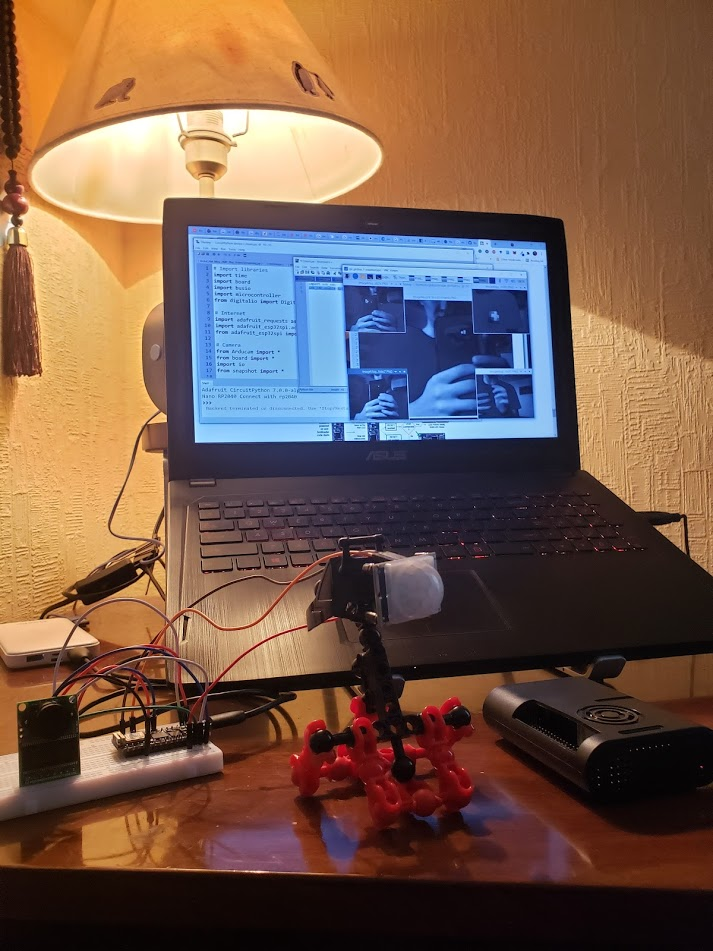

# Edge Device Hierarchy with funcX

This project enables building Edge-Cloud edge device networks in Python

In this repository, you'll fine a hierarchy of devices offloading heavy tasks to computational machines up in the tree, using [funcX][1]. As of now, it has three devices: Arduino Nano RP2040 Connect, Raspberry Pi 4 Model B (RPi 4), and an AWS EC2 instance. 

The repository contains two similar use cases: 

1. Nano RP2040 takes temperature measurements and constantly predicts the next temperature with a simple neural network. If the predicted temperature exceeds a threshold, Nano RP2040 takes a picture with a camera module OV2640 SPI and sends it to RPi 4. RPi 4 receives the image and runs a pre-trained convolutional neural network, classifying if the image has any humans. If it does, it requests a funcX task from an endpoint, such as a laptop or an AWS instance, asking it to do face recognition on the received image and return the results. 
2. The second use case is identical, only instead of taking temperature measurements, Nano RP2040 uses a motion sensor HC-SR501 and sends the image if any movement is detected.

Nano RP2040 also hosts a WSGI server, allowing it to receive requests from other machines. For example, you can request to change the temperature threshold.

The list of dependencies, installation guides, files, and references is grouped by the relevant folders. 



## Table of Contents

   * [Edge Device Hierarchy with funcX](#hierarchy)
      * [Installation](#installation)


## Installation

This is an overarching process. For details on each step, look at the corresponding folders.

1. Clone the repository:
```
git clone https://github.com/nikita-kotsehub/funcX-edge-device-hierarchy.git
```
2. Set up your microcontroller.
3. Set up Raspberry Pi 4.
4. Set up your own funcx-endpoint, follow [this guide][2]. 


[1]: https://funcx.org/ "funcX"
[2]: https://funcx.readthedocs.io/en/latest/endpoints.html
